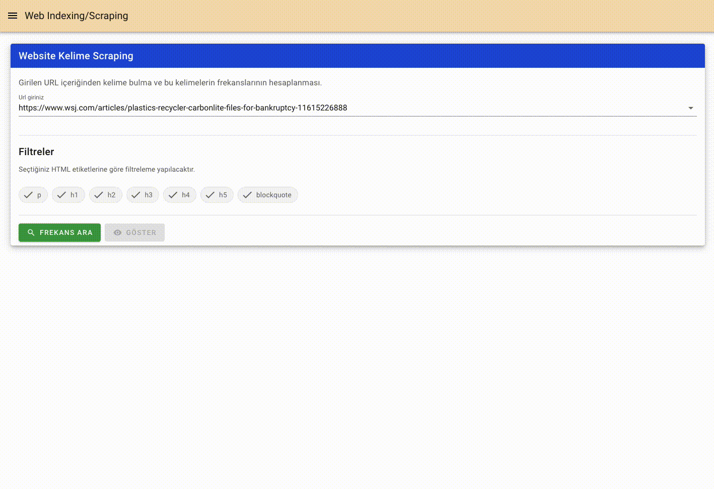

# web_indexing_kou
A small web scraping test project using Javascript & Vue.js.  

## Project setup
```
yarn install
```

### Compiles and hot-reloads for development
```
yarn serve
```

### Compiles and minifies for production
```
yarn build
```

### Lints and fixes files
```
yarn lint
```

### Dependencies
```
- [axios]: used for fetching data. (Can be replaced with javascript fetch API)
- [uuid]: used in nested tree elements rather than using index value.
- [vuetify]: UI components
```

## Main Components
###```1- URLFrekans.vue```


###```2- KeywordsFromWebPage.vue```
- By URL
  
- By WebPage
  
###```3- SiteRankingComponent.vue(incomplete)```

###```4- SemantikAnalizComponent.vue```

### See [live version](https://musical-doodle.vercel.app/).

### Customize configuration
See [Configuration Reference](https://cli.vuejs.org/config/).
